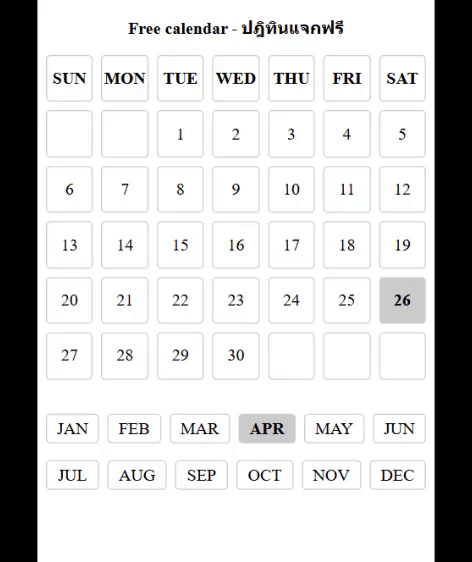

# free-calendar
MIT open source, React, TypeScript, Vite, SCSS




# How to run the project locally

- Required software/tools:
  - Node 22 or newer
  - VS Code or other editors
  - Git
  - Linux, Mac or Windows
  - Chrome or other browsers
- Download souce code:
  ```sh
  git clone git@github.com:codesanook/free-calendar.git
  ```
- Open the project folder with VS Code.
- Launch an integrated terminal or press **ctrl + `**.
- In the terminal, build and run the project with the following commands:
  ```sh
    yarn
    yarn dev
  ```
- In an intetegrated terminal click http://localhost:5174/ link to open a calendar 
with your browser.

## Useful videos/articles/links:

- [Create React Project with Vite for Beginners](https://www.youtube.com/watch?v=8vh5dmBaVQw)
- [How to use Sass in React with Vite](https://www.youtube.com/watch?v=SX9lDjFgeUU)

- const newArray = Array.from({ length: 7 }, (value, index) => index);
https://github.com/date-fns/date-fns/issues/644
